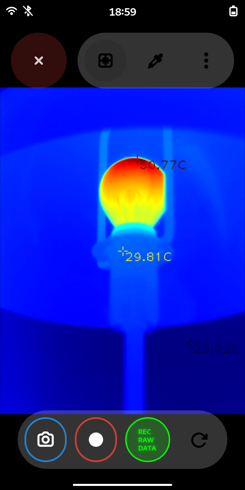

# HT301 Thermal Camera Viewer

A modern GTK4 application for viewing and capturing thermal images from the HT301 thermal camera. Built with Python and libadwaita for a native GNOME experience.


## Features

- 🎨 Multiple colormaps for thermal visualization
- 🔄 Image transformations (flip/rotate) for any camera orientation
- 🌡️ Temperature measurement points (min/max/center)
- 📸 Screenshot capture
- 🎥 Video recording
- 🖱️ Draggable window interface
- 💻 Cross-platform support (Linux, including mobile Linux distributions)

### Colormap Selection
Choose from various colormaps to enhance thermal visualization:

<details>
<summary>See colormap picker</summary>


</details>

### Image Transformations
Easily adjust camera orientation with transform tools. This is particularly useful when:
- Using the camera in selfie mode on mobile devices
- Using the camera with USB extension cables on PC
- Mounting the camera in different orientations


### Mobile Support
Works great on mobile Linux distributions like Mobian:

<details>
<summary>See mobile screenshot</summary>


</details>

## Installation

### Dependencies

First, install the required system packages:
```bash
sudo apt-get install python3-gi python3-gi-cairo gir1.2-gtk-4.0 libadwaita-1-dev
```

Then install Python dependencies:
```bash
pip install -r requirements.txt
```

### Running the Application

Basic usage:
```bash
python3 main.py
```

<details>
<summary>Alternative setup (make executable)</summary>

Make the script executable and run it directly:
```bash
chmod +x main.py
./main.py
```
</details>

### Flatpak

> 🚧 **Coming Soon!** Flatpak package is under development.

## About

This application was developed as an experiment in programming with Agentic AI using [Cursor](https://www.cursor.com).

It has been tested with:

Operating Systems:
- Ubuntu 24.04
- Mobian weekly image

Cameras:
- HT301 thermal camera


## Credits

This application is based on:
- [ht301_hacklib](https://github.com/stawel/ht301_hacklib/) (GPL-3.0)
- [GNOME Snapshot](https://gitlab.gnome.org/GNOME/snapshot/) (GPL-3.0)

The app is released under the GPL-3.0 license.

## Contributing

Feel free to report issues or suggest improvements through GitHub issues. While I appreciate contributions, I may not be able to actively maintain pull requests due to time constraints.
